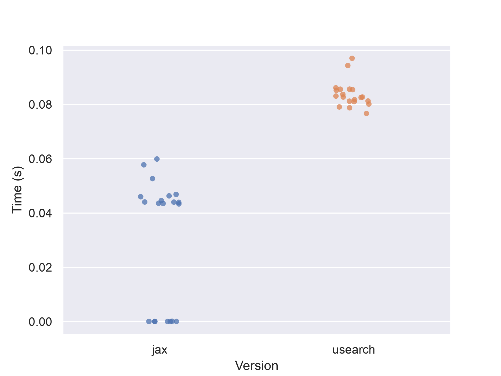

# jax-vs-usearch

Comparing jax & usearch for L2 nearest neighbor search.

Install with [`uv`](https://docs.astral.sh/uv/).

Testing via `pytest` and `pytest-benchmark` to see the basic doctest example works and compare speeds:

```
uv run pytest -v --doctest-modules --benchmark-min-rounds 20                                                                                                                                                                       
===================================================================================================================== test session starts ======================================================================================
platform darwin -- Python 3.13.3, pytest-8.4.1, pluggy-1.6.0 -- /Users/graham/tmp/jax-vs-usearch/.venv/bin/python3
cachedir: .pytest_cache
benchmark: 5.1.0 (defaults: timer=time.perf_counter disable_gc=False min_rounds=20 min_time=0.000005 max_time=1.0 calibration_precision=10 warmup=False warmup_iterations=100000)
rootdir: /Users/graham/tmp/jax-vs-usearch
configfile: pyproject.toml
plugins: benchmark-5.1.0
collected 4 items

src/jax_vs_usearch/via_jax.py::jax_vs_usearch.via_jax.L2Similarity PASSED                                                                                                                                                [ 25%]
src/jax_vs_usearch/via_usearch.py::jax_vs_usearch.via_usearch.L2Similarity PASSED                                                                                                                                        [ 50%]
tests/test_jvu.py::test_benchmark[jax] PASSED                                                                                                                                                                            [ 75%]
tests/test_jvu.py::test_benchmark[usearch] PASSED                                                                                                                                                                        [100%]


------------------------------------------------------------------------------------------------- benchmark: 2 tests ------------------------------------------------------------------------------------------------
Name (time in us)                   Min                    Max                   Mean                 StdDev                 Median                    IQR            Outliers      OPS            Rounds  Iterations
---------------------------------------------------------------------------------------------------------------------------------------------------------------------------------------------------------------------
test_benchmark[jax]             31.0410 (1.0)      37,601.7909 (1.0)      23,894.9271 (1.0)      17,959.1564 (1.84)     36,414.9590 (1.0)      36,681.0410 (3.91)          7;0  41.8499 (1.0)          20           1
test_benchmark[usearch]     45,278.6670 (>1000.0)  79,234.4590 (2.11)     52,352.6395 (2.19)      9,768.5350 (1.0)      47,653.9165 (1.31)      9,384.6875 (1.0)           4;2  19.1012 (0.46)         20           1
---------------------------------------------------------------------------------------------------------------------------------------------------------------------------------------------------------------------

Legend:
  Outliers: 1 Standard Deviation from Mean; 1.5 IQR (InterQuartile Range) from 1st Quartile and 3rd Quartile.
  OPS: Operations Per Second, computed as 1 / Mean
====================================================================================================================== 4 passed in 2.95s =======================================================================================
```



